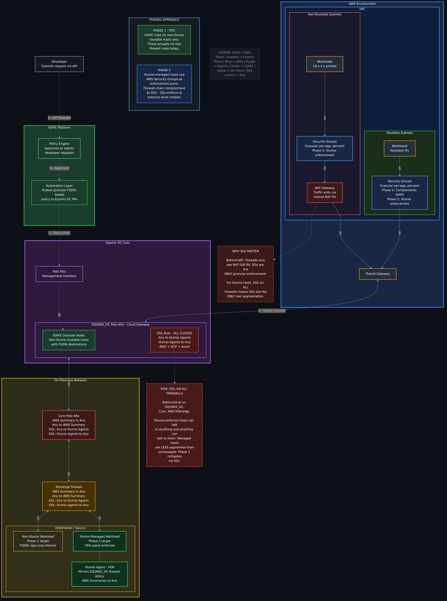
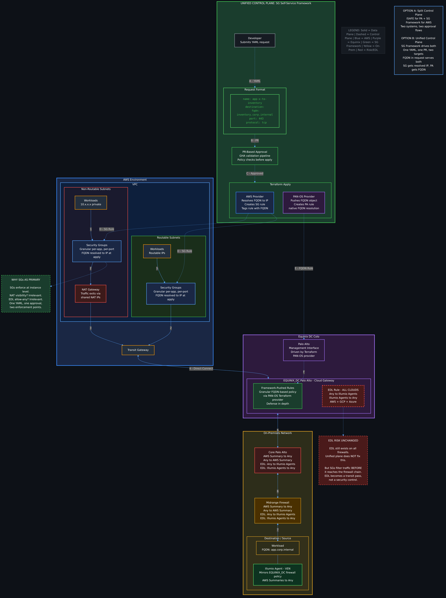

# AWS Firewall Automation Control Plane Architecture

| Choose One [X] | ADR Type | Description |
|---|---|---|
| X | architecture | Describes a solution that the NSAE team proposes for the architecture of the AWS firewall automation control plane, establishing a precedent for future multi-cloud firewall automation. |

## ADR Status History

| Authors | Status | Date | Deciders |
|---|---|---|---|
| NSAE | Proposed | 2026-04-06 | N/A |

## Terms

| Term | Definition |
|---|---|
| ISAFE | Internal Security Automation and Firewall Engine. A standalone automation platform that receives programmatic API calls from developers and pushes granular firewall policy to Palo Alto firewalls via the management interface. |
| EDL | External Dynamic List. A dynamically-updated IP list on Palo Alto firewalls populated by Illumio automation containing enforced VEN agent IPs. |
| EQUINIX_DC Firewalls | Palo Alto firewalls located in the Equinix DC colo functioning as cloud gateway firewalls. The primary ingress/egress point for cloud-to-on-prem traffic via Direct Connect. |
| FQDN Object | A Palo Alto address object that uses a fully qualified domain name instead of an IP address, allowing the firewall to dynamically resolve destinations. |
| VEN | Virtual Enforcement Node. The Illumio agent installed on managed workloads for microsegmentation visibility and enforcement. |
| SG Framework | The AWS Security Group self-service framework providing developer self-service via YAML requests, PR-based approval, Terraform automation, and GHA validation pipelines. |
| Non-Routable Subnets | AWS VPC subnets with private IP ranges that route through a NAT Gateway to reach external destinations. Firewall visibility is limited to the NAT Gateway IP. |
| Routable Subnets | AWS VPC subnets with IPs that are directly visible end-to-end across the network without NAT translation. |

## Context & Problem Statement

The current firewall rule request process for cloud-to-on-prem and on-prem-to-cloud connectivity requires manual ticket submission and review, resulting in a 1-2 week turnaround time per request. This creates a bottleneck for development teams and incentivizes workarounds that weaken the security posture.

Additionally, the current firewall chain between AWS and on-premises presents a potential segmentation risk if cloud summary ranges were broadly opened on Illumio VENs. An Illumio EDL-based rule exists on **all firewalls in the path** (EQUINIX_DC, Core, and Midrange) that allows bidirectional traffic between Illumio-enforced agents and any destination. Under the current SOP, granular Illumio rules are written per-workload, which limits the blast radius. However, if the approach shifted to broad cloud summary allowances on VENs, the EDL rule would effectively eliminate segmentation for all managed workloads:

- Illumio-managed workloads would be able to communicate with any destination across AWS, GCP, and Azure without restriction at the firewall layer.
- Managed hosts would become paradoxically **less segmented** than unmanaged hosts, as unmanaged hosts must match specific firewall rules while managed hosts pass through the broad EDL rule.
- The EDL rule is load-bearing for all three cloud environments and cannot be modified without risk to GCP and Azure traffic flows.

This is not a current problem statement under normal SOP, but represents a gap that must be addressed if the architecture moves toward broader cloud summary rules on Illumio VENs.

For workloads behind a NAT Gateway in non-routable subnets, the firewall chain has an additional visibility limitation. The firewall only sees the NAT Gateway IP as the source, not the individual workload IP. This makes it impossible to write granular per-workload firewall rules for NATted traffic. Security Groups are the only enforcement point that sees the true source and destination at the instance level.

The NSAE team requires an architecture that enables zero-touch developer self-service for firewall rules while improving the segmentation posture for AWS workloads and preventing security group leakage across single-tenant accounts.

### Current Traffic Flow

```
AWS Workload → Security Group → NAT GW (non-routable) or direct (routable)
  → Transit Gateway → Direct Connect → EQUINIX_DC Palo Alto
  → Core Palo Alto → Midrange Firewall → On-Prem Workload (Illumio VEN)
```

### Current Firewall Rules (All Firewalls)

| Firewall | Rule | Type | Impact |
|---|---|---|---|
| EQUINIX_DC | EDL: Any to Illumio Agents | Current | Bidirectional allow for all enforced agents |
| EQUINIX_DC | EDL: Illumio Agents to Any | Current | across AWS, GCP, and Azure |
| Core | EDL: Any to Illumio Agents | Current | Same EDL pass-through as EQUINIX_DC |
| Core | EDL: Illumio Agents to Any | Current | |
| Midrange | EDL: Any to Illumio Agents | Current | Same EDL pass-through as EQUINIX_DC |
| Midrange | EDL: Illumio Agents to Any | Current | |
| Core | AWS Summary to Any | **Proposed (POC)** | Coarse-grain cloud summary rules for POC |
| Core | Any to AWS Summary | **Proposed (POC)** | |
| Midrange | AWS Summary to Any | **Proposed (POC)** | Coarse-grain cloud summary rules for POC |
| Midrange | Any to AWS Summary | **Proposed (POC)** | |

## Decision Drivers

| ID | Criteria |
|---|---|
| 1 | MUST enable zero-touch developer self-service for cloud-to-on-prem firewall rules |
| 2 | MUST reduce firewall rule request turnaround from 1-2 weeks to near-instantaneous |
| 3 | MUST improve segmentation posture for AWS workloads |
| 4 | MUST prevent security group leakage across single-tenant accounts |
| 5 | MUST NOT disrupt existing GCP and Azure traffic flows through the EDL rule |
| 6 | SHOULD support FQDN-based destination objects for firewall policy |
| 7 | SHOULD provide auditability and approval workflow for all rule changes |
| 8 | SHOULD minimize blast radius during POC and phased rollout |

*Table 1. Decision driver criteria used to evaluate the proposed options*

## Options Considered

- **Option 1: Split Control Plane** - ISAFE manages Palo Alto firewall rules at the Equinix DC gateway, SG Framework manages AWS Security Groups. Two separate systems with independent approval workflows.
- **Option 2: Unified Control Plane** - SG Framework extended to manage both AWS Security Groups AND Palo Alto firewall rules via PAN-OS Terraform provider. Single YAML request, single PR approval, two enforcement points.

### Option 1: Split Control Plane (ISAFE + SG Framework)



ISAFE operates as a standalone automation platform that receives programmatic API calls from developers for Palo Alto firewall rules. It includes a built-in policy engine that approves or rejects requests before pushing granular FQDN-based policy to the EQUINIX_DC Palo Alto firewalls via the management interface.

The SG Framework operates independently to manage AWS Security Groups via YAML requests, PR-based approval, and Terraform automation.

**Phased Approach:**
- **Phase 1 (POC):** ISAFE handles rules for non-Illumio routable hosts on EQUINIX_DC firewalls. These are workloads that actually hit real firewall rules today (not bypassed by the EDL). SG Framework manages AWS-side enforcement.
- **Phase 2:** For Illumio-managed hosts where the entire firewall chain is compromised by the EDL allow-any rule, AWS Security Groups become the primary enforcement point. SGs enforce at the instance level regardless of downstream firewall rules.

| ID | Criteria | Status | Description |
|---|---|---|---|
| 1 | MUST enable zero-touch self-service | ✅ | Developers submit API requests to ISAFE for PA rules and YAML PRs for SG rules |
| 2 | MUST reduce turnaround to near-instantaneous | 🟨 | Two separate approval flows may introduce coordination overhead |
| 3 | MUST improve segmentation posture | ✅ | ISAFE provides granular FQDN rules on EQUINIX_DC; SGs provide instance-level enforcement |
| 4 | MUST prevent SG leakage | ✅ | SG Framework enforces account-scoped workspaces and mandatory tags |
| 5 | MUST NOT disrupt GCP/Azure | ✅ | EDL rule untouched; ISAFE rules added above EDL on EQUINIX_DC only |
| 6 | SHOULD support FQDN destinations | ✅ | ISAFE pushes native FQDN objects to Palo Alto |
| 7 | SHOULD provide auditability | 🟨 | Two audit trails across two systems |
| 8 | SHOULD minimize blast radius | ✅ | Phase 1 scoped to non-Illumio routable hosts only |

*Table 2. Option 1 Evaluation*

**Advantages:**
- Separation of concerns between cloud-native and perimeter security
- Each team maintains ownership of their respective platform
- ISAFE leverages native Palo Alto FQDN resolution
- Phase 1 POC has minimal blast radius

**Disadvantages:**
- Two systems to maintain, two approval workflows, two audit trails
- Developer must understand which system to submit requests to
- Policy coherence across SG and PA rules is not enforced
- FQDN-to-IP translation not automated for the SG side

### Option 2: Unified Control Plane (SG Framework Extended)



The existing SG Framework is extended to manage both AWS Security Groups and Palo Alto firewall rules. A single YAML request captures the developer's intent including FQDN destination. Terraform apply splits into two provider targets:

- **AWS Provider:** Resolves the FQDN to IP at apply time, creates the SG rule, tags the rule with the source FQDN for traceability.
- **PAN-OS Provider:** Pushes a native FQDN object and corresponding rule to the EQUINIX_DC Palo Alto firewall via the management interface.

One YAML, one PR, one approval - two enforcement points, each using the format they are best at. SGs get resolved IPs, Palo Alto gets native FQDN objects.

| ID | Criteria | Status | Description |
|---|---|---|---|
| 1 | MUST enable zero-touch self-service | ✅ | Single YAML request covers both SG and PA rules |
| 2 | MUST reduce turnaround to near-instantaneous | ✅ | Single PR approval triggers both enforcement points |
| 3 | MUST improve segmentation posture | ✅ | SGs provide instance-level enforcement; PA provides perimeter defense in depth |
| 4 | MUST prevent SG leakage | ✅ | SG Framework enforces account-scoped workspaces and mandatory tags |
| 5 | MUST NOT disrupt GCP/Azure | ✅ | EDL rule untouched; framework-pushed rules added above EDL on EQUINIX_DC only |
| 6 | SHOULD support FQDN destinations | ✅ | FQDN in YAML serves both targets: resolved to IP for SG, native FQDN for PA |
| 7 | SHOULD provide auditability | ✅ | Single audit trail via PR history in GitHub |
| 8 | SHOULD minimize blast radius | ✅ | SGs filter traffic before it reaches the firewall chain; EDL becomes transit pass |

*Table 3. Option 2 Evaluation*

**Advantages:**
- Single system, single approval flow, single audit trail
- Developer submits one request regardless of enforcement target
- Policy coherence enforced by design (same YAML drives both targets)
- FQDN in the request is human-readable intent; framework determines enforcement per platform
- SGs as primary enforcement mean EDL risk is mitigated without modifying the EDL rule
- Directly extends existing SG Framework investment (YAML requests, PR workflow, GHA pipeline, Terraform, account-scoped workspaces, mandatory tags)

**Disadvantages:**
- Larger initial scope of work to integrate PAN-OS Terraform provider
- SG-side FQDN resolution is point-in-time at apply; stale IPs require a refresh mechanism for dynamic destinations
- Organizational alignment required to consolidate perimeter and cloud-native security under one workflow

## Decision

*Pending review and approval.*

Both options are technically viable. The split control plane (Option 1) offers a lower-risk POC path with clear team ownership boundaries. The unified control plane (Option 2) provides a simpler operational model with stronger policy coherence but requires broader organizational alignment.

**Recommendation:** Begin with Option 1 (Split Control Plane) for the POC phase, scoped to non-Illumio routable hosts. This proves the automation model with minimal blast radius. Evaluate Option 2 (Unified Control Plane) as the strategic target architecture once the POC validates the self-service model and organizational readiness is assessed.

## Phase 1 POC Checklist

The following items must be completed to kick off the Phase 1 POC (Split Control Plane, non-Illumio routable hosts).

### Prerequisites

- [ ] **Validate FQDN object support on Palo Alto appliance** - Test FQDN object creation and use in security policy on the EQUINIX_DC Palo Alto. Confirm DNS resolution behavior, refresh intervals, and rule match accuracy against live traffic.
- [ ] **Validate PAN-OS API / Terraform provider connectivity** - Confirm programmatic access to the EQUINIX_DC Palo Alto management interface. Test rule creation, modification, and deletion via API or PAN-OS Terraform provider from the automation platform.
- [ ] **Identify POC workloads** - Select a set of non-Illumio routable AWS workloads with known on-prem destinations for initial rule automation. Prefer workloads with stable, well-documented traffic patterns.

### Developer Experience

- [ ] **Standardize developer submission schema** - Define the YAML/API request format with fields required for gateway PA policy creation (source workload, destination FQDN, port, protocol, business justification, environment, expiration).
- [ ] **Collaborate with Stephen Bulmer on required DX for developers** - Align on developer-facing workflow, documentation, submission interface, and feedback mechanisms (approval notifications, rule status, error handling).
- [ ] **Define SG Framework request schema alignment** - Ensure the SG Framework YAML schema and ISAFE API schema are compatible to enable future unification (Option 2).

### Policy Engine

- [ ] **Define policy engine capable of zero-touch approval** - Establish automated approval criteria (known-good FQDN lists, approved port ranges, environment-scoped rules, tag requirements). Define what qualifies for auto-approve vs. manual review.
- [ ] **Define automated exception process** - Build the ISAFE reject pipeline for requests that violate policy standards (overly broad rules, disallowed ports, missing fields, cross-environment requests). Define escalation path for legitimate exceptions that require manual override.
- [ ] **Establish rule lifecycle management** - Define TTL/expiration policy for automated rules, periodic review cadence, and orphaned rule cleanup process.

### Operational Readiness

- [ ] **Establish logging and monitoring** - Ensure ISAFE-pushed rules on EQUINIX_DC are logged separately from existing rules. Build dashboards for rule hit counts, zero-hit rules (candidates for removal), and policy engine approval/rejection rates.
- [ ] **Define rollback procedure** - Document the process to revert ISAFE-pushed rules in the event of a bad policy push. Test bulk rule removal via API.
- [ ] **Proposed POC coarse-grain rules on Core/Midrange** - Deploy the proposed AWS Summary to Any / Any to AWS Summary rules on Core and Midrange firewalls to support POC traffic. These are net-new rules scoped to POC ranges only.
- [ ] **Coordinate with Illumio team** - Confirm that POC workloads are non-Illumio managed and will not match the EDL rule. Document the boundary between ISAFE-managed and Illumio-managed workloads.
- [ ] **Define success criteria** - Establish measurable POC exit criteria (e.g., rule deployment latency < X minutes, zero mismatched rules after Y days, developer satisfaction score).

## Consequences

**Positive Consequences**

- Developer self-service reduces firewall rule turnaround from 1-2 weeks to near-instantaneous
- Improved segmentation posture for AWS workloads at both the SG and perimeter layers
- Auditability and approval workflow for all rule changes via PR history or ISAFE policy engine
- EDL risk is surfaced and mitigated through phased SG enforcement without disrupting existing multi-cloud traffic
- Framework establishes a precedent for future GCP and Azure firewall automation

**Negative Consequences**

- EDL allow-any rule remains on all firewalls during both phases; full remediation requires a separate initiative to scope or decompose the EDL rule
- For Option 1, two separate systems require developers to understand routing of requests
- For Option 2, initial development effort to integrate PAN-OS Terraform provider into the SG Framework
- NAT Gateway visibility limitation means firewall-layer granularity is inherently limited for non-routable subnets regardless of option chosen

**Risk: EDL on All Firewalls**

The Illumio EDL rule exists on EQUINIX_DC, Core, and Midrange firewalls with bidirectional allow (Any to Illumio Agents, Illumio Agents to Any) across all three cloud environments. Under current SOP, granular Illumio rules limit the effective blast radius. However, if the architecture moves toward broad cloud summary allowances on Illumio VENs, the EDL rule would effectively eliminate segmentation for all managed workloads at the firewall layer. Both options mitigate this risk for AWS workloads by establishing SGs as the primary granular enforcement point. A separate initiative is recommended to evaluate scoping or decomposing the EDL rule across the firewall chain if broader VEN policies are adopted.

## References

- [Split Control Plane Architecture Diagram](diagrams/split-control-plane.png)
- [Unified Control Plane Architecture Diagram](diagrams/unified-control-plane.png)
- AWS Security Group Self-Service Framework (terraform-aws-eks-baseline-sgs)
- Palo Alto PAN-OS Terraform Provider Documentation
