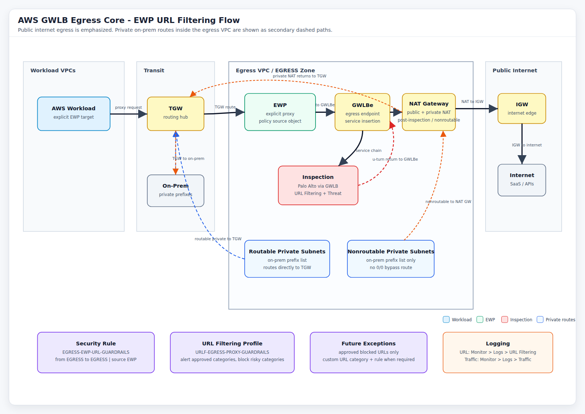

# AWS GWLB Egress Core - EWP URL Filtering Policy Plan

## Scope

This document defines the Panorama / PAN-OS 10.2.x policy structure for the AWS GWLB egress-core design:

```text
AWS workload -> EWP -> TGW -> EWP in egress VPC -> GWLBe -> inspection -> GWLBe return -> NAT Gateway -> IGW
```

The firewall policy intent is **not** to be a blind `EWP -> any 443` IPS-only path. The EWP/firewall egress rule should allow web egress, while the attached URL Filtering profile applies category-based guardrails and logs URL decisions.

The targeted App-ID deny controls placed above this rule are documented in [AWS GWLB Egress Core - App-ID Deny Policy](aws-gwlb-egress-app-id-deny-policy.md).

## Panorama Inputs

```text
Device Group: AWS_GWLB_EGRESSCORE_NP
Rulebase: pre-rulebase
From Zone: EGRESS
To Zone: EGRESS
EWP Source Address Object: EWP
URL Filtering Profile: URLF-EGRESS-PROXY-GUARDRAILS
Security Rule Name: EGRESS-EWP-URL-GUARDRAILS
Future Exception Custom URL Category: URLC-EGRESS-APPROVED-EXCEPTIONS
Future Exception Rule Name: EGRESS-EWP-ALLOW-URL-EXCEPTIONS
```


## Architecture Diagram

The current AWS GWLB egress-core flow diagram is available here:



Editable standalone HTML version:

```text
diagrams/aws-gwlb-egress-flow.html
```

## Design Summary

Initial policy structure:

1. **Single EWP egress allow rule**
   - `from EGRESS`
   - `to EGRESS`
   - source: `EWP`
   - destination: `any`
   - applications: `ssl`, `web-browsing`
   - service: `application-default`
   - action: `allow`
   - log at session end
   - attach URL Filtering profile `URLF-EGRESS-PROXY-GUARDRAILS`

2. **URL Filtering profile handles category allow/block behavior**
   - `alert` categories are allowed and logged to URL Filtering logs
   - `block` categories are blocked and logged to URL Filtering logs
   - default response page exists; HTTPS block-page presentation is only reliable with SSL decryption

3. **No explicit catch-all deny rule required**
   - traffic not matching the allow rule falls to intrazone/interzone defaults

4. **Exception rule/category kept on deck, not built initially**
   - used later when a business-approved operational URL is blocked by category
   - exceptions should be domain/FQDN/URL-list based, not broad IP holes unless absolutely required

## Initial Set Commands

### Enter Configuration Mode

```bash
configure
```

### Create URL Filtering Profile

```bash
set device-group AWS_GWLB_EGRESSCORE_NP profiles url-filtering URLF-EGRESS-PROXY-GUARDRAILS description "AWS EWP egress URL guardrails"
set device-group AWS_GWLB_EGRESSCORE_NP profiles url-filtering URLF-EGRESS-PROXY-GUARDRAILS log-container-page-only yes
```

### Proposed URL Category Action Matrix

This is the reviewable category/action list for the EWP egress URL Filtering profile. Every listed category should be explicitly configured so URL Filtering logs are generated consistently.


Proposed model:


- `block`: deny and log in URL Filtering logs
- `alert`: allow and log in URL Filtering logs
- Business-approved blocked sites move through the exception process later, not by weakening the baseline profile.


| PAN-OS category | Display name | Proposed action | Review note |
|---|---|---|---|
| `abortion` | Abortion | `alert` | Allowed but logged; policy/legal preference review. |
| `abused-drugs` | Abused Drugs | `block` | Legal/liability risk. |
| `adult` | Adult | `block` | Legal/liability risk. |
| `alcohol-and-tobacco` | Alcohol and Tobacco | `alert` | Allowed but logged; policy preference. |
| `ai-code-assistant` | AI Code Assistant | `block` | Data/code exfil risk; approve by exception. |
| `ai-conversational-assistant` | AI Conversational Assistant | `block` | Data exfil risk; approve by exception. |
| `ai-data-and-workflow-optimizer` | AI Data and Workflow Optimizer | `block` | Data exfil/workflow risk; approve by exception. |
| `ai-meeting-assistant` | AI Meeting Assistant | `block` | Meeting/content exfil risk; approve by exception. |
| `ai-media-service` | AI Media Service | `alert` | Allowed but logged. |
| `ai-platform-service` | AI Platform Service | `block` | GenAI platform/data exfil risk; approve by exception. |
| `ai-website-generator` | AI Website Generator | `alert` | Allowed but logged. |
| `ai-writing-assistant` | AI Writing Assistant | `block` | Data exfil risk; approve by exception. |
| `auctions` | Auctions | `alert` | Allowed but logged. |
| `browser-runtime-attack` | Browser Runtime Attack | `block` | Exploit/malicious browser behavior. |
| `business-and-economy` | Business and Economy | `alert` | Business web allowed and logged. |
| `command-and-control` | Command and Control | `block` | Known C2. |
| `compromised-website` | Compromised Website | `block` | Known compromised content. |
| `computer-and-internet-info` | Computer and Internet Info | `alert` | Business/technical web allowed and logged. |
| `content-delivery-networks` | Content Delivery Networks | `alert` | Required for SaaS/web dependencies; logged. |
| `copyright-infringement` | Copyright Infringement | `block` | Legal/liability risk. |
| `cryptocurrency` | Cryptocurrency | `alert` | Allowed but logged; may be tightened later. |
| `dating` | Dating | `alert` | Allowed but logged; policy preference. |
| `dynamic-dns` | Dynamic DNS | `block` | Common abuse/C2 infrastructure. |
| `educational-institutions` | Educational Institutions | `alert` | Allowed but logged. |
| `encrypted-dns` | Encrypted DNS | `block` | Prevents DNS control bypass. |
| `entertainment-and-arts` | Entertainment and Arts | `alert` | Allowed but logged. |
| `extremism` | Extremism | `block` | Legal/liability risk. |
| `file-converter` | File Converter | `alert` | Allowed but logged; watch data upload risk. |
| `financial-services` | Financial Services | `alert` | Allowed but logged. |
| `gambling` | Gambling | `block` | Legal/liability risk. |
| `games` | Games | `alert` | Allowed but logged; policy preference. |
| `government` | Government | `alert` | Allowed but logged. |
| `grayware` | Grayware | `block` | Unwanted/abusive behavior. |
| `hacking` | Hacking | `block` | Security risk. |
| `health-and-medicine` | Health and Medicine | `alert` | Allowed but logged. |
| `home-and-garden` | Home and Garden | `alert` | Allowed but logged. |
| `hunting-and-fishing` | Hunting and Fishing | `alert` | Allowed but logged. |
| `insufficient-content` | Insufficient Content | `block` | Unknown/insufficient signal; approve by exception if needed. |
| `internet-communications-and-telephony` | Internet Communications and Telephony | `alert` | Allowed but logged. |
| `internet-portals` | Internet Portals | `alert` | Allowed but logged. |
| `job-search` | Job Search | `alert` | Allowed but logged. |
| `legal` | Legal | `alert` | Allowed but logged. |
| `malware` | Malware | `block` | Known malicious. |
| `marijuana` | Marijuana | `alert` | Allowed but logged; policy/legal review. |
| `military` | Military | `alert` | Allowed but logged. |
| `motor-vehicles` | Motor Vehicles | `alert` | Allowed but logged. |
| `music` | Music | `alert` | Allowed but logged. |
| `newly-registered-domain` | Newly Registered Domain | `block` | High abuse likelihood; exception if business-approved. |
| `news` | News | `alert` | Allowed but logged. |
| `not-resolved` | Not-Resolved | `block` | Cannot categorize/resolve; exception if required. |
| `nudity` | Nudity | `alert` | Allowed but logged; policy preference. |
| `online-storage-and-backup` | Online Storage and Backup | `alert` | Allowed but logged; watch exfil risk. |
| `parked` | Parked | `block` | Low business value/high abuse. |
| `peer-to-peer` | Peer-to-peer | `block` | Bypass/data risk. |
| `personal-sites-and-blogs` | Personal Sites and Blogs | `alert` | Allowed but logged. |
| `philosophy-and-political-advocacy` | Philosophy and Political Advocacy | `alert` | Allowed but logged. |
| `phishing` | Phishing | `block` | Known malicious. |
| `private-ip-addresses` | Private IP Addresses | `block` | Not valid internet egress target; prevent weird bypass. |
| `proxy-avoidance-and-anonymizers` | Proxy Avoidance and Anonymizers | `block` | Bypass category. |
| `questionable` | Questionable | `block` | Low business value/high risk. |
| `ransomware` | Ransomware | `block` | Known malicious. |
| `real-estate` | Real Estate | `alert` | Allowed but logged. |
| `real-time-detection` | Real-time Detection | `block` | Advanced URL Filtering real-time malicious verdict. |
| `recreation-and-hobbies` | Recreation and Hobbies | `alert` | Allowed but logged. |
| `reference-and-research` | Reference and Research | `alert` | Allowed but logged. |
| `religion` | Religion | `alert` | Allowed but logged. |
| `remote-access` | Remote Access | `alert` | Allowed but logged; may need environment-specific block/exception handling. |
| `scanning-activity` | Scanning Activity | `block` | Recon/scanning behavior. |
| `search-engines` | Search Engines | `alert` | Allowed but logged. |
| `sex-education` | Sex Education | `alert` | Allowed but logged. |
| `shareware-and-freeware` | Shareware and Freeware | `alert` | Allowed but logged; file controls still apply. |
| `shopping` | Shopping | `alert` | Allowed but logged. |
| `social-networking` | Social Networking | `alert` | Allowed but logged. |
| `society` | Society | `alert` | Allowed but logged. |
| `sports` | Sports | `alert` | Allowed but logged. |
| `stock-advice-and-tools` | Stock Advice and Tools | `alert` | Allowed but logged. |
| `streaming-media` | Streaming Media | `alert` | Allowed but logged; bandwidth policy review. |
| `swimsuits-and-intimate-apparel` | Swimsuits and Intimate Apparel | `alert` | Allowed but logged; policy preference. |
| `training-and-tools` | Training and Tools | `alert` | Allowed but logged. |
| `translation` | Translation | `alert` | Allowed but logged. |
| `travel` | Travel | `alert` | Allowed but logged. |
| `unknown` | Unknown | `block` | Unknown categorization; exception if business-approved. |
| `weapons` | Weapons | `block` | Legal/liability risk. |
| `web-advertisements` | Web Advertisements | `alert` | Allowed but logged; can be blocked later if desired. |
| `web-based-email` | Web-based Email | `alert` | Allowed but logged; policy preference. |
| `web-hosting` | Web Hosting | `alert` | Allowed but logged. |
| `high-risk` | High Risk | `alert` | Risk overlay logged; concrete malicious categories still block. |
| `medium-risk` | Medium Risk | `alert` | Risk overlay logged. |
| `low-risk` | Low Risk | `alert` | Risk overlay logged. |

### URL Category Set Commands

Use the reviewed matrix above to build the profile. The current proposed command set is below. If the team changes any category from `alert` to `block` or vice versa, update the matching command before implementation.

```bash
set device-group AWS_GWLB_EGRESSCORE_NP profiles url-filtering URLF-EGRESS-PROXY-GUARDRAILS alert abortion
set device-group AWS_GWLB_EGRESSCORE_NP profiles url-filtering URLF-EGRESS-PROXY-GUARDRAILS block abused-drugs
set device-group AWS_GWLB_EGRESSCORE_NP profiles url-filtering URLF-EGRESS-PROXY-GUARDRAILS block adult
set device-group AWS_GWLB_EGRESSCORE_NP profiles url-filtering URLF-EGRESS-PROXY-GUARDRAILS alert alcohol-and-tobacco
set device-group AWS_GWLB_EGRESSCORE_NP profiles url-filtering URLF-EGRESS-PROXY-GUARDRAILS block ai-code-assistant
set device-group AWS_GWLB_EGRESSCORE_NP profiles url-filtering URLF-EGRESS-PROXY-GUARDRAILS block ai-conversational-assistant
set device-group AWS_GWLB_EGRESSCORE_NP profiles url-filtering URLF-EGRESS-PROXY-GUARDRAILS block ai-data-and-workflow-optimizer
set device-group AWS_GWLB_EGRESSCORE_NP profiles url-filtering URLF-EGRESS-PROXY-GUARDRAILS block ai-meeting-assistant
set device-group AWS_GWLB_EGRESSCORE_NP profiles url-filtering URLF-EGRESS-PROXY-GUARDRAILS alert ai-media-service
set device-group AWS_GWLB_EGRESSCORE_NP profiles url-filtering URLF-EGRESS-PROXY-GUARDRAILS block ai-platform-service
set device-group AWS_GWLB_EGRESSCORE_NP profiles url-filtering URLF-EGRESS-PROXY-GUARDRAILS alert ai-website-generator
set device-group AWS_GWLB_EGRESSCORE_NP profiles url-filtering URLF-EGRESS-PROXY-GUARDRAILS block ai-writing-assistant
set device-group AWS_GWLB_EGRESSCORE_NP profiles url-filtering URLF-EGRESS-PROXY-GUARDRAILS alert auctions
set device-group AWS_GWLB_EGRESSCORE_NP profiles url-filtering URLF-EGRESS-PROXY-GUARDRAILS block browser-runtime-attack
set device-group AWS_GWLB_EGRESSCORE_NP profiles url-filtering URLF-EGRESS-PROXY-GUARDRAILS alert business-and-economy
set device-group AWS_GWLB_EGRESSCORE_NP profiles url-filtering URLF-EGRESS-PROXY-GUARDRAILS block command-and-control
set device-group AWS_GWLB_EGRESSCORE_NP profiles url-filtering URLF-EGRESS-PROXY-GUARDRAILS block compromised-website
set device-group AWS_GWLB_EGRESSCORE_NP profiles url-filtering URLF-EGRESS-PROXY-GUARDRAILS alert computer-and-internet-info
set device-group AWS_GWLB_EGRESSCORE_NP profiles url-filtering URLF-EGRESS-PROXY-GUARDRAILS alert content-delivery-networks
set device-group AWS_GWLB_EGRESSCORE_NP profiles url-filtering URLF-EGRESS-PROXY-GUARDRAILS block copyright-infringement
set device-group AWS_GWLB_EGRESSCORE_NP profiles url-filtering URLF-EGRESS-PROXY-GUARDRAILS alert cryptocurrency
set device-group AWS_GWLB_EGRESSCORE_NP profiles url-filtering URLF-EGRESS-PROXY-GUARDRAILS alert dating
set device-group AWS_GWLB_EGRESSCORE_NP profiles url-filtering URLF-EGRESS-PROXY-GUARDRAILS block dynamic-dns
set device-group AWS_GWLB_EGRESSCORE_NP profiles url-filtering URLF-EGRESS-PROXY-GUARDRAILS alert educational-institutions
set device-group AWS_GWLB_EGRESSCORE_NP profiles url-filtering URLF-EGRESS-PROXY-GUARDRAILS block encrypted-dns
set device-group AWS_GWLB_EGRESSCORE_NP profiles url-filtering URLF-EGRESS-PROXY-GUARDRAILS alert entertainment-and-arts
set device-group AWS_GWLB_EGRESSCORE_NP profiles url-filtering URLF-EGRESS-PROXY-GUARDRAILS block extremism
set device-group AWS_GWLB_EGRESSCORE_NP profiles url-filtering URLF-EGRESS-PROXY-GUARDRAILS alert file-converter
set device-group AWS_GWLB_EGRESSCORE_NP profiles url-filtering URLF-EGRESS-PROXY-GUARDRAILS alert financial-services
set device-group AWS_GWLB_EGRESSCORE_NP profiles url-filtering URLF-EGRESS-PROXY-GUARDRAILS block gambling
set device-group AWS_GWLB_EGRESSCORE_NP profiles url-filtering URLF-EGRESS-PROXY-GUARDRAILS alert games
set device-group AWS_GWLB_EGRESSCORE_NP profiles url-filtering URLF-EGRESS-PROXY-GUARDRAILS alert government
set device-group AWS_GWLB_EGRESSCORE_NP profiles url-filtering URLF-EGRESS-PROXY-GUARDRAILS block grayware
set device-group AWS_GWLB_EGRESSCORE_NP profiles url-filtering URLF-EGRESS-PROXY-GUARDRAILS block hacking
set device-group AWS_GWLB_EGRESSCORE_NP profiles url-filtering URLF-EGRESS-PROXY-GUARDRAILS alert health-and-medicine
set device-group AWS_GWLB_EGRESSCORE_NP profiles url-filtering URLF-EGRESS-PROXY-GUARDRAILS alert home-and-garden
set device-group AWS_GWLB_EGRESSCORE_NP profiles url-filtering URLF-EGRESS-PROXY-GUARDRAILS alert hunting-and-fishing
set device-group AWS_GWLB_EGRESSCORE_NP profiles url-filtering URLF-EGRESS-PROXY-GUARDRAILS block insufficient-content
set device-group AWS_GWLB_EGRESSCORE_NP profiles url-filtering URLF-EGRESS-PROXY-GUARDRAILS alert internet-communications-and-telephony
set device-group AWS_GWLB_EGRESSCORE_NP profiles url-filtering URLF-EGRESS-PROXY-GUARDRAILS alert internet-portals
set device-group AWS_GWLB_EGRESSCORE_NP profiles url-filtering URLF-EGRESS-PROXY-GUARDRAILS alert job-search
set device-group AWS_GWLB_EGRESSCORE_NP profiles url-filtering URLF-EGRESS-PROXY-GUARDRAILS alert legal
set device-group AWS_GWLB_EGRESSCORE_NP profiles url-filtering URLF-EGRESS-PROXY-GUARDRAILS block malware
set device-group AWS_GWLB_EGRESSCORE_NP profiles url-filtering URLF-EGRESS-PROXY-GUARDRAILS alert marijuana
set device-group AWS_GWLB_EGRESSCORE_NP profiles url-filtering URLF-EGRESS-PROXY-GUARDRAILS alert military
set device-group AWS_GWLB_EGRESSCORE_NP profiles url-filtering URLF-EGRESS-PROXY-GUARDRAILS alert motor-vehicles
set device-group AWS_GWLB_EGRESSCORE_NP profiles url-filtering URLF-EGRESS-PROXY-GUARDRAILS alert music
set device-group AWS_GWLB_EGRESSCORE_NP profiles url-filtering URLF-EGRESS-PROXY-GUARDRAILS block newly-registered-domain
set device-group AWS_GWLB_EGRESSCORE_NP profiles url-filtering URLF-EGRESS-PROXY-GUARDRAILS alert news
set device-group AWS_GWLB_EGRESSCORE_NP profiles url-filtering URLF-EGRESS-PROXY-GUARDRAILS block not-resolved
set device-group AWS_GWLB_EGRESSCORE_NP profiles url-filtering URLF-EGRESS-PROXY-GUARDRAILS alert nudity
set device-group AWS_GWLB_EGRESSCORE_NP profiles url-filtering URLF-EGRESS-PROXY-GUARDRAILS alert online-storage-and-backup
set device-group AWS_GWLB_EGRESSCORE_NP profiles url-filtering URLF-EGRESS-PROXY-GUARDRAILS block parked
set device-group AWS_GWLB_EGRESSCORE_NP profiles url-filtering URLF-EGRESS-PROXY-GUARDRAILS block peer-to-peer
set device-group AWS_GWLB_EGRESSCORE_NP profiles url-filtering URLF-EGRESS-PROXY-GUARDRAILS alert personal-sites-and-blogs
set device-group AWS_GWLB_EGRESSCORE_NP profiles url-filtering URLF-EGRESS-PROXY-GUARDRAILS alert philosophy-and-political-advocacy
set device-group AWS_GWLB_EGRESSCORE_NP profiles url-filtering URLF-EGRESS-PROXY-GUARDRAILS block phishing
set device-group AWS_GWLB_EGRESSCORE_NP profiles url-filtering URLF-EGRESS-PROXY-GUARDRAILS block private-ip-addresses
set device-group AWS_GWLB_EGRESSCORE_NP profiles url-filtering URLF-EGRESS-PROXY-GUARDRAILS block proxy-avoidance-and-anonymizers
set device-group AWS_GWLB_EGRESSCORE_NP profiles url-filtering URLF-EGRESS-PROXY-GUARDRAILS block questionable
set device-group AWS_GWLB_EGRESSCORE_NP profiles url-filtering URLF-EGRESS-PROXY-GUARDRAILS block ransomware
set device-group AWS_GWLB_EGRESSCORE_NP profiles url-filtering URLF-EGRESS-PROXY-GUARDRAILS alert real-estate
set device-group AWS_GWLB_EGRESSCORE_NP profiles url-filtering URLF-EGRESS-PROXY-GUARDRAILS block real-time-detection
set device-group AWS_GWLB_EGRESSCORE_NP profiles url-filtering URLF-EGRESS-PROXY-GUARDRAILS alert recreation-and-hobbies
set device-group AWS_GWLB_EGRESSCORE_NP profiles url-filtering URLF-EGRESS-PROXY-GUARDRAILS alert reference-and-research
set device-group AWS_GWLB_EGRESSCORE_NP profiles url-filtering URLF-EGRESS-PROXY-GUARDRAILS alert religion
set device-group AWS_GWLB_EGRESSCORE_NP profiles url-filtering URLF-EGRESS-PROXY-GUARDRAILS alert remote-access
set device-group AWS_GWLB_EGRESSCORE_NP profiles url-filtering URLF-EGRESS-PROXY-GUARDRAILS block scanning-activity
set device-group AWS_GWLB_EGRESSCORE_NP profiles url-filtering URLF-EGRESS-PROXY-GUARDRAILS alert search-engines
set device-group AWS_GWLB_EGRESSCORE_NP profiles url-filtering URLF-EGRESS-PROXY-GUARDRAILS alert sex-education
set device-group AWS_GWLB_EGRESSCORE_NP profiles url-filtering URLF-EGRESS-PROXY-GUARDRAILS alert shareware-and-freeware
set device-group AWS_GWLB_EGRESSCORE_NP profiles url-filtering URLF-EGRESS-PROXY-GUARDRAILS alert shopping
set device-group AWS_GWLB_EGRESSCORE_NP profiles url-filtering URLF-EGRESS-PROXY-GUARDRAILS alert social-networking
set device-group AWS_GWLB_EGRESSCORE_NP profiles url-filtering URLF-EGRESS-PROXY-GUARDRAILS alert society
set device-group AWS_GWLB_EGRESSCORE_NP profiles url-filtering URLF-EGRESS-PROXY-GUARDRAILS alert sports
set device-group AWS_GWLB_EGRESSCORE_NP profiles url-filtering URLF-EGRESS-PROXY-GUARDRAILS alert stock-advice-and-tools
set device-group AWS_GWLB_EGRESSCORE_NP profiles url-filtering URLF-EGRESS-PROXY-GUARDRAILS alert streaming-media
set device-group AWS_GWLB_EGRESSCORE_NP profiles url-filtering URLF-EGRESS-PROXY-GUARDRAILS alert swimsuits-and-intimate-apparel
set device-group AWS_GWLB_EGRESSCORE_NP profiles url-filtering URLF-EGRESS-PROXY-GUARDRAILS alert training-and-tools
set device-group AWS_GWLB_EGRESSCORE_NP profiles url-filtering URLF-EGRESS-PROXY-GUARDRAILS alert translation
set device-group AWS_GWLB_EGRESSCORE_NP profiles url-filtering URLF-EGRESS-PROXY-GUARDRAILS alert travel
set device-group AWS_GWLB_EGRESSCORE_NP profiles url-filtering URLF-EGRESS-PROXY-GUARDRAILS block unknown
set device-group AWS_GWLB_EGRESSCORE_NP profiles url-filtering URLF-EGRESS-PROXY-GUARDRAILS block weapons
set device-group AWS_GWLB_EGRESSCORE_NP profiles url-filtering URLF-EGRESS-PROXY-GUARDRAILS alert web-advertisements
set device-group AWS_GWLB_EGRESSCORE_NP profiles url-filtering URLF-EGRESS-PROXY-GUARDRAILS alert web-based-email
set device-group AWS_GWLB_EGRESSCORE_NP profiles url-filtering URLF-EGRESS-PROXY-GUARDRAILS alert web-hosting
set device-group AWS_GWLB_EGRESSCORE_NP profiles url-filtering URLF-EGRESS-PROXY-GUARDRAILS alert high-risk
set device-group AWS_GWLB_EGRESSCORE_NP profiles url-filtering URLF-EGRESS-PROXY-GUARDRAILS alert medium-risk
set device-group AWS_GWLB_EGRESSCORE_NP profiles url-filtering URLF-EGRESS-PROXY-GUARDRAILS alert low-risk
```
### Create Security Policy Rule

```bash
set device-group AWS_GWLB_EGRESSCORE_NP pre-rulebase security rules EGRESS-EWP-URL-GUARDRAILS from EGRESS
set device-group AWS_GWLB_EGRESSCORE_NP pre-rulebase security rules EGRESS-EWP-URL-GUARDRAILS to EGRESS
set device-group AWS_GWLB_EGRESSCORE_NP pre-rulebase security rules EGRESS-EWP-URL-GUARDRAILS source EWP
set device-group AWS_GWLB_EGRESSCORE_NP pre-rulebase security rules EGRESS-EWP-URL-GUARDRAILS destination any
set device-group AWS_GWLB_EGRESSCORE_NP pre-rulebase security rules EGRESS-EWP-URL-GUARDRAILS application ssl
set device-group AWS_GWLB_EGRESSCORE_NP pre-rulebase security rules EGRESS-EWP-URL-GUARDRAILS application web-browsing
set device-group AWS_GWLB_EGRESSCORE_NP pre-rulebase security rules EGRESS-EWP-URL-GUARDRAILS service application-default
set device-group AWS_GWLB_EGRESSCORE_NP pre-rulebase security rules EGRESS-EWP-URL-GUARDRAILS action allow
set device-group AWS_GWLB_EGRESSCORE_NP pre-rulebase security rules EGRESS-EWP-URL-GUARDRAILS log-end yes
set device-group AWS_GWLB_EGRESSCORE_NP pre-rulebase security rules EGRESS-EWP-URL-GUARDRAILS profile-setting profiles url-filtering URLF-EGRESS-PROXY-GUARDRAILS
```

### Commit / Push

```bash
commit
```

Then push the device group to the target firewalls from Panorama. Exact command may vary by environment/device group scoping, but the operation is a Panorama device-group push/commit-all.

## URL Filtering Logging

### Is URL Filtering Logging Enabled by Default?

URL Filtering logs are generated when all of these are true:

1. Traffic matches an **allow** security rule.
2. That rule has a **URL Filtering profile** attached.
3. The matching URL category action is log-producing, such as:
   - `alert` - allow and log
   - `block` - block and log
   - `continue` / `override` - user interaction actions, also logged

So the script above **does enable URL Filtering logging behavior** by:

- attaching `URLF-EGRESS-PROXY-GUARDRAILS` to `EGRESS-EWP-URL-GUARDRAILS`
- setting allowed categories to `alert`
- setting denied categories to `block`

`log-end yes` on the security rule controls **Traffic logs**, not URL Filtering logs. URL Filtering logs come from the URL Filtering profile actions.

### Where to View URL Filtering Logs

In Panorama or the firewall UI:

```text
Monitor > Logs > URL Filtering
```

Useful fields/filters:

```text
Rule = EGRESS-EWP-URL-GUARDRAILS
URL Category = <category>
Action = block-url / alert / allowed equivalent
Source = EWP source IP
Destination = destination IP
URL / Host = requested domain or URL
Application = ssl or web-browsing
```

Traffic logs remain under:

```text
Monitor > Logs > Traffic
```

Traffic logs show the session matched the allow rule and whether it ended normally. URL category decisions are primarily visible in **URL Filtering logs**, not Traffic logs.

## Block Page Behavior

PAN-OS includes default URL Filtering response pages. A custom response page is optional.

Expected behavior:

- **HTTP blocked by URL profile:** user should receive a visible Palo Alto URL Filtering block page.
- **HTTPS blocked without SSL decryption:** user may see a reset, browser TLS error, or generic connection failure instead of a clean block page.
- **HTTPS blocked with SSL Forward Proxy decryption:** user experience is much more likely to show the Palo Alto block page cleanly.

Reason: without decryption, the firewall can usually only classify based on TLS metadata such as SNI/certificate/destination. It cannot reliably inject an HTTP block page inside an encrypted session where it is not acting as the TLS endpoint.

## Future Exception Process

Create the exception rule/category only when the first approved exception is required.

When a business-approved operational URL is blocked by the guardrails profile:

1. Operations/app team opens an exception request.
2. Request must include:
   - business owner
   - application/workload
   - requested domain/FQDN/URL pattern
   - reason the destination is required
   - evidence of business approval
   - expected traffic type/port, usually HTTPS/443
   - expiration/review date
3. Security/network team validates:
   - domain ownership/reputation
   - URL category and reason for block
   - whether the destination should be allowed by category tuning or specific exception
   - whether raw IP allowlisting is truly required
4. Approved exception is added to a custom URL category or URL EDL.
5. A dedicated exception allow rule is inserted above the general URL guardrails rule.
6. Exception allow rule still receives the same security profile stack. It is a policy exception, not an inspection bypass.

### Future Exception Object

```bash
set device-group AWS_GWLB_EGRESSCORE_NP profiles custom-url-category URLC-EGRESS-APPROVED-EXCEPTIONS type "URL List"
set device-group AWS_GWLB_EGRESSCORE_NP profiles custom-url-category URLC-EGRESS-APPROVED-EXCEPTIONS list vendor.example.com
set device-group AWS_GWLB_EGRESSCORE_NP profiles custom-url-category URLC-EGRESS-APPROVED-EXCEPTIONS list "*.vendor.example.com"
```

### Future Exception Rule

```bash
set device-group AWS_GWLB_EGRESSCORE_NP pre-rulebase security rules EGRESS-EWP-ALLOW-URL-EXCEPTIONS from EGRESS
set device-group AWS_GWLB_EGRESSCORE_NP pre-rulebase security rules EGRESS-EWP-ALLOW-URL-EXCEPTIONS to EGRESS
set device-group AWS_GWLB_EGRESSCORE_NP pre-rulebase security rules EGRESS-EWP-ALLOW-URL-EXCEPTIONS source EWP
set device-group AWS_GWLB_EGRESSCORE_NP pre-rulebase security rules EGRESS-EWP-ALLOW-URL-EXCEPTIONS destination any
set device-group AWS_GWLB_EGRESSCORE_NP pre-rulebase security rules EGRESS-EWP-ALLOW-URL-EXCEPTIONS application ssl
set device-group AWS_GWLB_EGRESSCORE_NP pre-rulebase security rules EGRESS-EWP-ALLOW-URL-EXCEPTIONS application web-browsing
set device-group AWS_GWLB_EGRESSCORE_NP pre-rulebase security rules EGRESS-EWP-ALLOW-URL-EXCEPTIONS service application-default
set device-group AWS_GWLB_EGRESSCORE_NP pre-rulebase security rules EGRESS-EWP-ALLOW-URL-EXCEPTIONS category URLC-EGRESS-APPROVED-EXCEPTIONS
set device-group AWS_GWLB_EGRESSCORE_NP pre-rulebase security rules EGRESS-EWP-ALLOW-URL-EXCEPTIONS action allow
set device-group AWS_GWLB_EGRESSCORE_NP pre-rulebase security rules EGRESS-EWP-ALLOW-URL-EXCEPTIONS log-end yes
set device-group AWS_GWLB_EGRESSCORE_NP pre-rulebase security rules EGRESS-EWP-ALLOW-URL-EXCEPTIONS profile-setting profiles url-filtering URLF-EGRESS-PROXY-GUARDRAILS
```

Place this rule above `EGRESS-EWP-URL-GUARDRAILS`.

## Verification Commands

```bash
set cli config-output-format set
show device-group AWS_GWLB_EGRESSCORE_NP profiles url-filtering URLF-EGRESS-PROXY-GUARDRAILS
show device-group AWS_GWLB_EGRESSCORE_NP pre-rulebase security rules EGRESS-EWP-URL-GUARDRAILS
```

After testing a blocked URL, verify in:

```text
Monitor > Logs > URL Filtering
```

Filter by:

```text
(rule eq 'EGRESS-EWP-URL-GUARDRAILS')
```

or by the EWP source IP.
